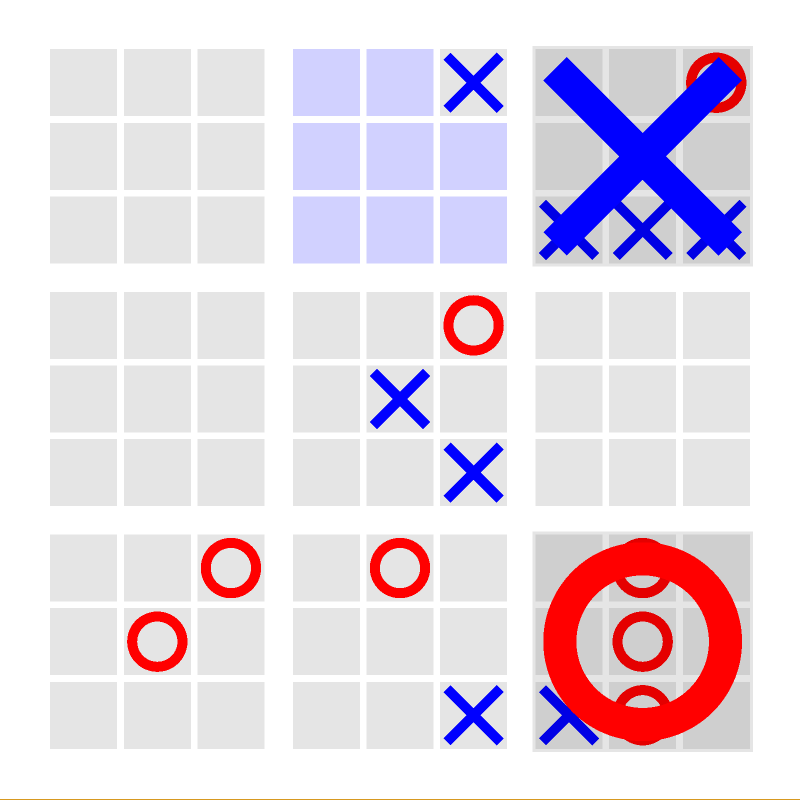

# Recursive Tic-Tac-Toe



A game of ultimate tic-tac-toe with an arbitrary amount of layers, written in
Python.

See this [blog post](https://mathwithbaddrawings.com/2013/06/16/ultimate-tic-tac-toe/) for a description of this game for depth level 2. Larger depths
work similarly.

## Requirements

Your machine must support OpenGL 3.3

Tested on Python 3.13.3 with the following libraries:
- numpy 2.3.0
- PyOpenGL 3.1.7
- pygame 2.6.1

## Installation

   ```bash
   git clone https://github.com/onur-saygili/tic-tac-toe.git
   cd tic-tac-toe

   pip install numpy
   pip install PyOpenGL PyOpenGL_accelerate
   pip install pygame
   ```

## Usage

Run with default settings:
```bash
python __main__.py
```
Command line options:
```
--depth LEVEL       Set recursion depth (default: 2)
--size SIZE         Set board size (default: 3)
--res PIXELS        Set window resolution (default: 800)
```
